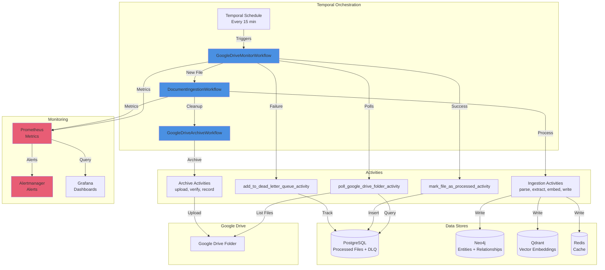
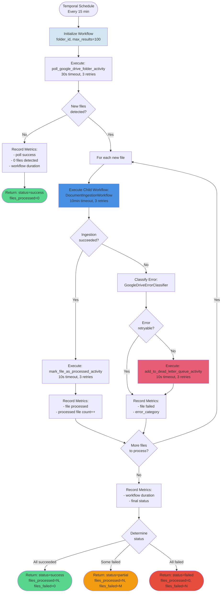
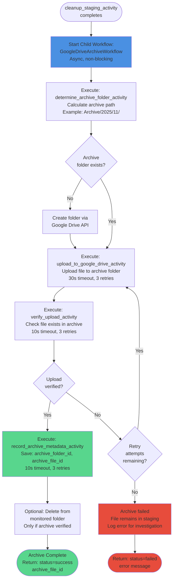
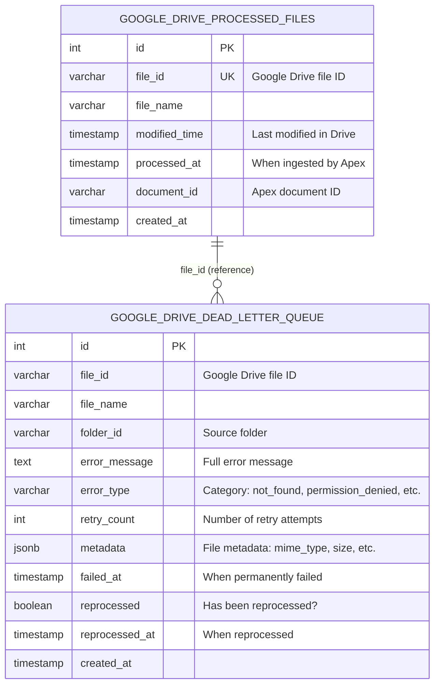
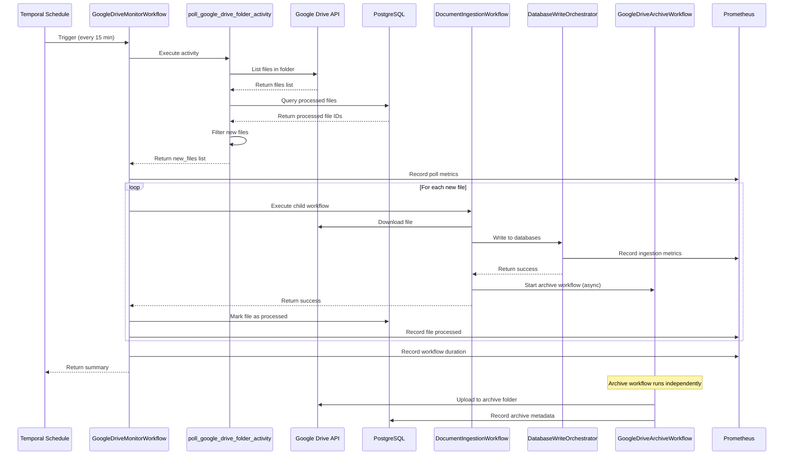

# Google Drive Integration - Architecture Diagrams

**Author:** Apex Infrastructure Team
**Created:** November 7, 2025 (Week 4 Day 2)
**Version:** 1.0

---

## Table of Contents

1. [System Overview](#system-overview)
2. [Workflow Orchestration](#workflow-orchestration)
3. [Monitoring Pipeline](#monitoring-pipeline)
4. [Error Handling Flow](#error-handling-flow)
5. [Archive Workflow](#archive-workflow)
6. [Component Interaction](#component-interaction)
7. [Database Schema](#database-schema)

---

## System Overview

### High-Level Architecture



**Key Components:**

- **Temporal Schedule:** Triggers monitor workflow every 15 minutes
- **GoogleDriveMonitorWorkflow:** Orchestrates file detection and ingestion
- **DocumentIngestionWorkflow:** Processes each detected file
- **GoogleDriveArchiveWorkflow:** Archives processed files (async)
- **Monitoring Stack:** Prometheus + Alertmanager + Grafana for observability

---

## Workflow Orchestration

### GoogleDriveMonitorWorkflow Flow



**State Persistence (Temporal):**
- `folder_id`, `current_status`, `last_poll_timestamp`
- `files_processed_count`, `files_failed_count`
- `new_files`, `error_message`

**Key Features:**
- Early return if no new files (efficient)
- Child workflow pattern (wait for completion)
- Error classification before DLQ routing
- Partial success reporting

---

### DocumentIngestionWorkflow Integration

```mermaid
flowchart LR
    MW[GoogleDriveMonitorWorkflow]
    MW --> |For each new file| CHILD[execute_child_workflow<br/>DocumentIngestionWorkflow]

    CHILD --> STAGE[pull_and_stage_document_activity<br/>Download from Google Drive]
    STAGE --> PARSE[parse_document_activity<br/>Docling parser]
    PARSE --> EXTRACT[extract_entities_activity<br/>OpenAI extraction]
    EXTRACT --> EMBED[generate_embeddings_activity<br/>OpenAI embeddings]
    EMBED --> WRITE[write_to_databases_activity<br/>Neo4j, PostgreSQL, Qdrant, Redis]
    WRITE --> CLEANUP[cleanup_staging_activity<br/>Remove staging + trigger archive]
    CLEANUP --> RETURN[Return: status, chunks, entities]

    RETURN --> MW

    style CHILD fill:#4A90E2
    style RETURN fill:#58D68D
```



**Ingestion Duration:** Typical 10-30 seconds per file
**Timeout:** 10 minutes per file
**Retries:** 3 attempts with exponential backoff

---

## Monitoring Pipeline

### Metrics Collection Architecture

```mermaid
graph TB
    subgraph "Workflow Layer"
        WF[GoogleDriveMonitorWorkflow<br/>+ DocumentIngestionWorkflow]
    end

    subgraph "Metrics Recording"
        M1[Poll Metrics<br/>polls_total, files_detected]
        M2[Processing Metrics<br/>files_processed, files_failed]
        M3[Duration Metrics<br/>monitor_duration, ingestion_duration]
        M4[DLQ Metrics<br/>Implicit via files_failed by error_type]
    end

    subgraph "Prometheus"
        SCRAPE[Scrape Endpoint<br/>:8000/metrics<br/>Every 15s]
        STORE[Time Series DB<br/>Retention: 15d]
    end

    subgraph "Alerting"
        RULES[Alert Rules<br/>12 alerts:<br/>3 critical, 5 warning, 4 info]
        EVAL[Alert Evaluation<br/>Every 30s]
        AM[Alertmanager<br/>Routing + Grouping]
    end

    subgraph "Visualization"
        GRAF[Grafana Dashboards<br/>Real-time monitoring]
    end

    subgraph "Notification Channels"
        EMAIL[Email<br/>team@company.com]
        SLACK[Slack<br/>#apex-alerts]
        PD[PagerDuty<br/>Critical only]
    end

    WF --> M1
    WF --> M2
    WF --> M3
    WF --> M4

    M1 --> SCRAPE
    M2 --> SCRAPE
    M3 --> SCRAPE
    M4 --> SCRAPE

    SCRAPE --> STORE
    STORE --> RULES
    RULES --> EVAL
    EVAL --> AM

    STORE --> GRAF

    AM --> EMAIL
    AM --> SLACK
    AM --> PD

    style WF fill:#4A90E2
    style SCRAPE fill:#E85D75
    style AM fill:#E85D75
    style PD fill:#E74C3C
```

**7 Prometheus Metrics:**
1. `apex_google_drive_monitor_polls_total` (Counter) - Poll success/failure
2. `apex_google_drive_files_detected_total` (Counter) - New files per poll
3. `apex_google_drive_files_processed_total` (Counter) - Successful ingestions
4. `apex_google_drive_files_failed_total` (Counter) - Failed ingestions by error_type
5. `apex_google_drive_monitor_duration_seconds` (Histogram) - Workflow duration
6. `apex_google_drive_processed_files_count` (Gauge) - Cumulative processed count
7. (Implicit) Error type distribution via labels on files_failed_total

**12 Alert Rules:**
- **3 Critical:** Workflow down, workflow failing, high failure rate (>50%)
- **5 Warning:** Moderate failure rate, slow workflow, DLQ growing, high poll duration, error spike
- **4 Info:** No new files, low throughput

---

## Error Handling Flow

### Error Classification and DLQ Routing

```mermaid
flowchart TD
    START([File Processing Failed]) --> CATCH[Catch Exception]

    CATCH --> CLASSIFY[GoogleDriveErrorClassifier<br/>.is_retryable]

    CLASSIFY --> CHECK_KEYWORDS{Check Error<br/>Keywords}

    CHECK_KEYWORDS -->|"rate limit"<br/>"timeout"<br/>"network"<br/>"temporary"| RETRYABLE[is_retryable = True<br/>error_category = "rate_limit" etc.]

    CHECK_KEYWORDS -->|"not found"<br/>"permission denied"<br/>"invalid"<br/>"deleted"| NON_RETRYABLE[is_retryable = False<br/>error_category = "not_found" etc.]

    CHECK_KEYWORDS -->|Unknown error| DEFAULT[is_retryable = True<br/>error_category = "unknown"<br/>Safer default]

    RETRYABLE --> LOG_RETRY[Log: Retryable error<br/>error_category in extra]
    NON_RETRYABLE --> LOG_NON[Log: Non-retryable error<br/>Adding to DLQ]
    DEFAULT --> LOG_RETRY

    LOG_RETRY --> METRIC_RETRY[Record Metric:<br/>files_failed_total{error_category}]
    LOG_NON --> METRIC_NON[Record Metric:<br/>files_failed_total{error_category}]

    METRIC_RETRY --> TEMPORAL_RETRY[Temporal retries<br/>per RetryPolicy<br/>max 3 attempts]
    METRIC_NON --> ADD_DLQ[Execute Activity:<br/>add_to_dead_letter_queue_activity]

    TEMPORAL_RETRY --> MAX_ATTEMPTS{Max attempts<br/>reached?}

    MAX_ATTEMPTS -->|No| BACKOFF[Exponential backoff<br/>Wait and retry]
    BACKOFF --> START

    MAX_ATTEMPTS -->|Yes| EVENTUAL_DLQ[Consider adding to DLQ<br/>after exhausting retries]

    ADD_DLQ --> DLQ_TABLE[(PostgreSQL<br/>google_drive_dead_letter_queue)]

    DLQ_TABLE --> INVESTIGATION[Manual Investigation<br/>Via troubleshooting runbook]

    INVESTIGATION --> REPROCESS{Can<br/>reprocess?}

    REPROCESS -->|Yes| MANUAL[Manual Reprocessing<br/>Trigger DocumentIngestionWorkflow]
    REPROCESS -->|No| MARK_DONE[Mark as reprocessed<br/>to prevent future alerts]

    MANUAL --> SUCCESS{Reprocessing<br/>succeeded?}

    SUCCESS -->|Yes| MARK_REPROCESSED[Execute Activity:<br/>mark_dlq_file_reprocessed_activity]
    SUCCESS -->|No| BACK_DLQ[Remains in DLQ<br/>for further investigation]

    style NON_RETRYABLE fill:#E85D75
    style ADD_DLQ fill:#E85D75
    style DLQ_TABLE fill:#F39C12
    style MARK_REPROCESSED fill:#58D68D
    style BACK_DLQ fill:#E74C3C
```

**Error Categories:**
- **Retryable:** rate_limit, timeout, network_error, unknown
- **Non-Retryable:** not_found, permission_denied, invalid_request

**DLQ Schema:**
- file_id, file_name, folder_id, error_message, error_type
- retry_count, metadata (JSONB), failed_at
- reprocessed (BOOLEAN), reprocessed_at

---

## Archive Workflow

### GoogleDriveArchiveWorkflow (Async)



**Key Design:**
- **Async trigger:** DocumentIngestionWorkflow doesn't wait for archive
- **Idempotent:** Can retry safely (checks if file already archived)
- **Verification:** Ensures file exists in archive before deleting from monitored folder
- **Metadata tracking:** Records archive location for audit trail

**Archive Folder Structure:**
```
Google Drive Archive/
├── 2025/
│   ├── 11/
│   │   ├── contract-001.pdf (archived Nov 2025)
│   │   └── contract-002.pdf
│   └── 12/
│       └── contract-003.pdf (archived Dec 2025)
└── 2026/
    └── 01/
        └── contract-004.pdf
```

---

## Component Interaction

### Activity-Level Interactions

```mermaid
graph TB
    subgraph "External Services"
        GD[Google Drive API<br/>www.googleapis.com]
        OPENAI[OpenAI API<br/>embeddings + extraction]
    end

    subgraph "Temporal Activities"
        subgraph "Monitoring Activities"
            POLL[poll_google_drive_folder_activity]
            MARK[mark_file_as_processed_activity]
            DLQ[add_to_dead_letter_queue_activity]
        end

        subgraph "Ingestion Activities"
            STAGE[pull_and_stage_document_activity]
            PARSE[parse_document_activity]
            EXTRACT[extract_entities_activity]
            EMBED[generate_embeddings_activity]
            WRITE[write_to_databases_activity]
            CLEANUP[cleanup_staging_activity]
        end

        subgraph "Archive Activities"
            DETERMINE[determine_archive_folder_activity]
            UPLOAD[upload_to_google_drive_activity]
            VERIFY[verify_upload_activity]
            RECORD[record_archive_metadata_activity]
        end
    end

    subgraph "Data Stores"
        PG[(PostgreSQL<br/>Processed Files<br/>DLQ)]
        NEO[(Neo4j<br/>Graph)]
        QDRANT[(Qdrant<br/>Vectors)]
        REDIS[(Redis<br/>Cache)]
        FS[Local Filesystem<br/>/tmp/apex-staging/]
    end

    subgraph "Services"
        GDS[GoogleDriveService<br/>Official SDK]
        DOCLING[Docling Parser<br/>Multi-format]
        ENTITY[EntityExtractor<br/>OpenAI GPT]
        EMBSVC[EmbeddingService<br/>OpenAI]
        WRITER[DatabaseWriteOrchestrator<br/>Saga Pattern]
    end

    POLL --> GDS
    GDS --> GD
    POLL --> PG

    MARK --> PG
    DLQ --> PG

    STAGE --> GDS
    STAGE --> FS

    PARSE --> FS
    PARSE --> DOCLING

    EXTRACT --> ENTITY
    ENTITY --> OPENAI

    EMBED --> EMBSVC
    EMBSVC --> OPENAI

    WRITE --> WRITER
    WRITER --> NEO
    WRITER --> QDRANT
    WRITER --> REDIS
    WRITER --> PG

    DETERMINE --> GDS
    UPLOAD --> GDS
    VERIFY --> GDS
    RECORD --> PG

    style POLL fill:#D4E6F1
    style STAGE fill:#D4E6F1
    style EXTRACT fill:#D4E6F1
    style WRITER fill:#58D68D
    style DLQ fill:#E85D75
```



**Service Dependencies:**
- **GoogleDriveService:** Official Python SDK (`google-api-python-client`)
- **Docling:** Multi-format parser (PDF, DOCX, PPTX, HTML, Markdown)
- **OpenAI:** GPT-4 for entity extraction, text-embedding-3-small for embeddings
- **DatabaseWriteOrchestrator:** Saga pattern for transactional writes

---

## Database Schema

### PostgreSQL Tables



**Indexes:**

```sql
-- google_drive_processed_files
CREATE INDEX idx_processed_files_file_id ON google_drive_processed_files(file_id);

-- google_drive_dead_letter_queue
CREATE INDEX idx_dlq_file_id ON google_drive_dead_letter_queue(file_id);
CREATE INDEX idx_dlq_error_type ON google_drive_dead_letter_queue(error_type);
CREATE INDEX idx_dlq_reprocessed ON google_drive_dead_letter_queue(reprocessed);
```

**Unique Constraints:**

```sql
-- google_drive_processed_files
ALTER TABLE google_drive_processed_files ADD CONSTRAINT unique_file_id UNIQUE (file_id);

-- google_drive_dead_letter_queue
ALTER TABLE google_drive_dead_letter_queue
ADD CONSTRAINT unique_file_id_failed_at UNIQUE (file_id, failed_at);
```

**Rationale:**
- `file_id` uniqueness prevents duplicate tracking
- `(file_id, failed_at)` allows same file to fail multiple times (different timestamps)
- JSONB `metadata` stores flexible file attributes (mime_type, size, etc.)

---

## Sequence Diagrams

### End-to-End File Processing



---

## Summary

This architecture provides:

✅ **Scalability:** Temporal schedules, parallel workflow execution
✅ **Reliability:** Retry policies, error classification, Dead Letter Queue
✅ **Observability:** Prometheus metrics, Grafana dashboards, 12 alerts
✅ **Maintainability:** Clear component separation, documented flows
✅ **Auditability:** Complete tracking in PostgreSQL (processed + DLQ)

**Key Architectural Decisions:**
1. **Temporal orchestration** - Durable workflows with automatic retries
2. **Child workflow pattern** - Wait for ingestion before marking processed
3. **Error classification** - Prevent retry storms for permanent failures
4. **Dead Letter Queue** - PostgreSQL for durability and queryability
5. **Async archive** - Non-blocking archive workflow
6. **Metrics-first** - 7 metrics + 12 alerts for complete observability

---

**Architecture Version:** 1.0
**Last Updated:** November 7, 2025
